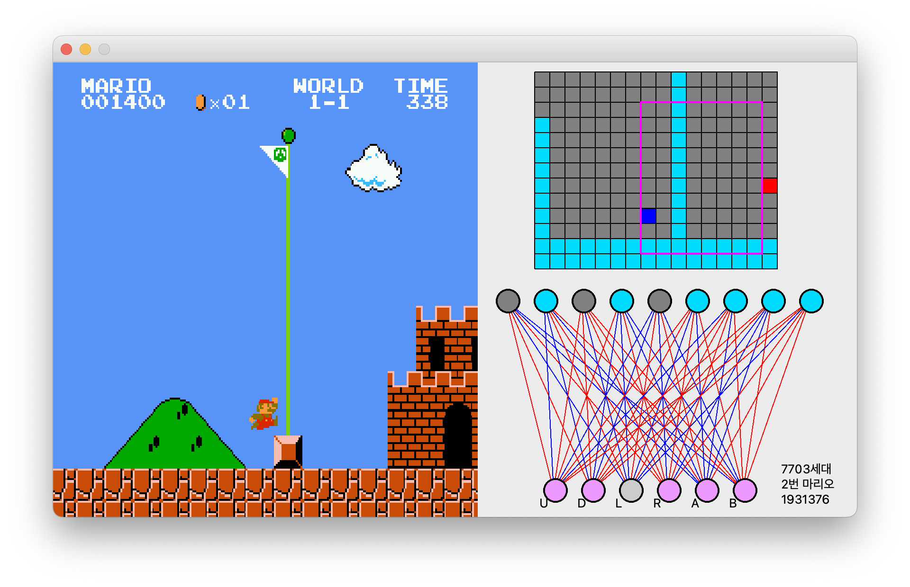

# Mario_DeepLearing (유전알고리즘과 인공신경망을 활용한 게임 학습)

### 결과
- 세대 : 7703세대,
- 시간 : 7일
- 느낀점 : 엘리트 보존을 사용하여 퇴화를 막았지만 계단식 성장을 하여 언젠간 성공하지만 언젠가가 오지 않을 까 두렵다.
- 마리오 게임 학습 완료 영상 : YouTube [Link](https://www.youtube.com/watch?v=icxwqmojT18)

## 환경 설정
```bash
>>> Window python=3.6
>>> Mac python=3.7
>>> pip install requirements.txt
```

# 마리오 학습 정리
 

# 보고서
![tabel]
# 인공신경망 사진
![tabel]
## Genentic_Algorithm.py
#### 활성화 함수
- ReLU
<pre><code>relu = lambda X: np.maximum(0, X) # 단층, Hidden_layer
self.l1 = relu(np.matmul(data, self.w1) + self.b1)</code></pre>
- Sigmoid
<pre><code>sigmoid = lambda X: 1.0 / (1.0 + np.exp(-X)) # Output_layer
output = sigmoid(np.matmul(self.l1, self.w2) + self.b2)</code></pre>

#### 선택
- 엘리트 보존 선택 2개
<pre><code>def elitist_preserve_selection(self): # 엘리트 보존 선택
    # 염색체 정렬(내림 차순) -> 정렬(염색체_배열, 적합도 함수 호출, )
    sort_chromosomes = sorted(self.chromosomes, key=lambda x: x.fitness(), reverse=True)
    return sort_chromosomes[:2] # 가장큰 2개의 숫자 출력</code></pre>
- 룰렛 휠 생성으로 8개 생성
<pre><code>def roulette_wheel_selection(self): # 룰렛 휠 선택? 적합도 ->
    result = [] # 결과 배열
    fitness_sum = sum(c.fitness() for c in self.chromosomes) #
    # 10개의 염색체 중 하나 선택
    # 적합도를 뽑아서 리스트에 넣고 그것을 더함

    for _ in range(2): # 2번 돌려 선택
        d
        pick = random.uniform(0, fitness_sum) # 0 ~ 10개의 염색체의 적합도의 합(랜덤 선택)
        # 0 ~ sum -0
        # uniform = 균등확률분포 값을 생성해주는 함수
        current = 0 # 현재
        for chromosome in self.chromosomes:
            current += chromosome.fitness()
            if current > pick:
                result.append(chromosome)
                break
        return result</code></pre>

#### 교배
- SBX(일점 교차)를 통해 교배
<pre><code>def SBX(self, p1, p2): # Simulated binary crossover // 일점 교차
    # 숫자를 비율로 쪼갬
    rand = np.random.random(p1.shape)
    gamma = np.empty(p1.shape)
    gamma[rand <= 0.5] = (2 * rand[rand <= 0.5]) ** (1.0 / (100 + 1))
    gamma[rand > 0.5] = (1.0 / (2.0 * (1.0 - rand[rand > 0.5]))) ** (1.0 / (100 + 1))
    c1 = 0.5 * ((1 + gamma) * p1 + (1 - gamma) * p2)
    c2 = 0.5 * ((1 - gamma) * p1 + (1 + gamma) * p2)
    return c1, c2</code></pre>
- crossover 교배 과정
<pre><code>def crossover(self, chromosome1, chromosome2):  # 교배 과정
    child1 = Chromosome()
    child2 = Chromosome()
    # 선택된 2개의 높은 염색체 2개의 자식 만듭
    child1.w1, child2.w1 = self.SBX(chromosome1.w1, chromosome2.w1)
    child1.b1, child2.b1 = self.SBX(chromosome1.b1, chromosome2.b1)
    child1.w2, child2.w2 = self.SBX(chromosome1.w2, chromosome2.w2)
    child1.b2, child2.b2 = self.SBX(chromosome1.b2, chromosome2.b2)
    # 어떤 문제를 하냐에 따라 결과가 달라짐 -> 실험// 문제마다 선택 교배 변이 내가 고르는 것
    return child1, child2</code></pre>
#### 변이
- 정적 돌연 변이
<pre><code>def static_mutation(self, data): # 정적 돌연 변이
    mutation_array = np.random.random(data.shape) < 0.05
    # 가우시안 돌연 변이
    gaussian_mutation = np.random.normal(size=data.shape) # 정규 분포
    data[mutation_array] += gaussian_mutation[mutation_array]</code></pre>
- 가우시안 돌연 변이
<pre><code>def mutation(self, chromosome): # 변이
    # 2번 호출됨
    self.static_mutation(chromosome.w1)
    self.static_mutation(chromosome.b1)
    self.static_mutation(chromosome.w2)
    self.static_mutation(chromosome.b2)</code></pre>     

유전 알고리즘은 자연 선택 과정에서 영감을 얻은 일종의 최적화 알고리즘입니다. 그것들은 일반적으로 최적화 및 검색 문제를 해결하기 위해 컴퓨터 과학 및 인공 지능에서 사용되며, 여기서 목표는 많은 잠재적 솔루션 세트에서 최상의 솔루션을 찾는 것입니다.

유전자 알고리즘에서 후보 솔루션의 모집단(종종 이진 문자열 또는 벡터로 표시됨)이 초기화됩니다. 각 솔루션은 품질을 측정하는 피트니스 함수를 기반으로 평가됩니다. 더 나은 피트니스 값을 가진 솔루션은 다음 세대를 위한 자손을 생산하기 위해 선택될 가능성이 더 높습니다. 자손 솔루션은 돌연변이 및 교차와 같은 유전 연산자를 적용하여 생성됩니다. 이 프로세스는 만족스러운 솔루션을 찾거나 중지 기준이 충족될 때까지 여러 세대 동안 계속됩니다.

유전 알고리즘은 분석 솔루션을 얻기 어려운 복잡한 실제 문제에 자주 사용되며 공학, 금융 및 생물 정보학을 포함한 많은 분야에 적용되었습니다.


