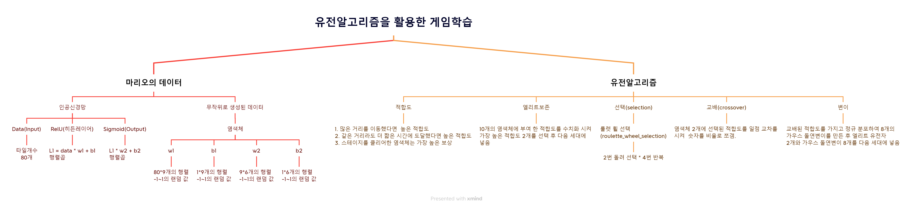
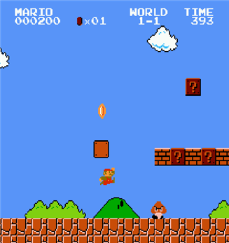
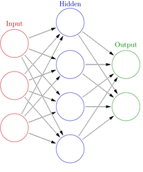
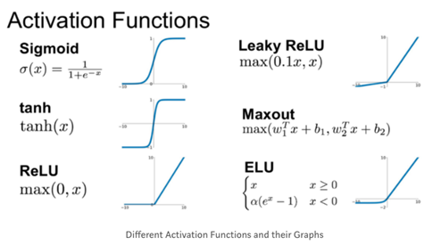
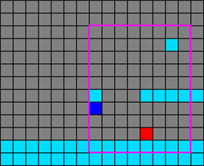

# Mario_DeepLearing
# 유전알고리즘과 인공신경망을 활용한 게임 학습

# 마리오 학습 정리
 
### 핵심코드
##### Genentic_Algorithm.py
<pre><code>
    relu = lambda X: np.maximum(0, X) # 단층, Hidden_layer
    sigmoid = lambda X: 1.0 / (1.0 + np.exp(-X)) # Output_layer
    
    class Chromosome:  # 염색체
    def __init__(self):
        # 4개의 유전자가 모여 하나의 염색체가 됨

        self.w1 = np.random.uniform(low=-1, high=1, size=(80, 9))
        self.b1 = np.random.uniform(low=-1, high=1, size=(9,))

        self.w2 = np.random.uniform(low=-1, high=1, size=(9, 6))
        self.b2 = np.random.uniform(low=-1, high=1, size=(6,))
        
        def predict(self, data): # 예측
        # data = Input_layer;
        self.l1 = relu(np.matmul(data, self.w1) + self.b1) # 행렬곱
        # sigmoid = Output_layer
        output = sigmoid(np.matmul(self.l1, self.w2) + self.b2) # 행렬곱
        # output = [-1 ~ 1, -1 ~ 1, -1 ~ 1, -1 ~ 1, -1 ~ 1, -1 ~ 1]
        # -1 ~ 1 사이의 값을 가진 6개의 output 중 0.5보다 크면 1로 바꾸고 아니면 0으로 출력
        result = (output > 0.5).astype(np.int)
        return result
        ## 자세한 코드는 ##### Genentic_Algorithm.py
    </code></pre>
# 마리오 게임

# Pyqt5로 그린 인공신경망 

# 인공신경망 예시
 
# 활성화 함수 ReLU, Sigmoid

# Pyqt5로 그린 게임 타일 정보

